# Building an API driven flow to create databases in Cloudant 
As described in the main [ReadME](https://github.com/pmmistry/AppConnectWorkshop#flows-for-api) ,a flow for an API contains a request, one or more target application actions, and a response.

In this lab we will create an API to create a database on Cloudant as well as an API to retrieve a list of databases created. 

Lets get started! 

## Prerequisites
- [Create IBM Cloud Account](https://github.com/pmmistry/AppConnectWorkshop#prerequisites)
- [Create App Connect Service](https://github.com/pmmistry/AppConnectWorkshop#prerequisites)
- [Create Cloudant Database](https://github.com/pmmistry/AppConnectWorkshop#prerequisites)

## Workshop

### Step 1 
To create flows for API, launch the App Connect dashboard and click on home page to create a new flow for API 
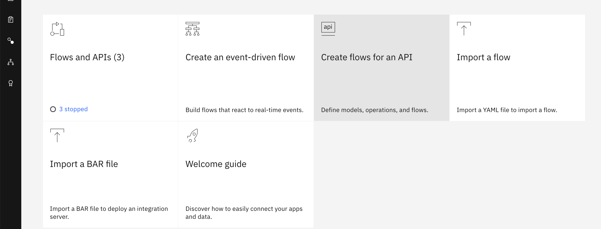

### Step 2
We will be creating some APIs that create and retrieves  databases in Cloudant. Start by giving your model a name such as `cloudantdb` and then create model. 
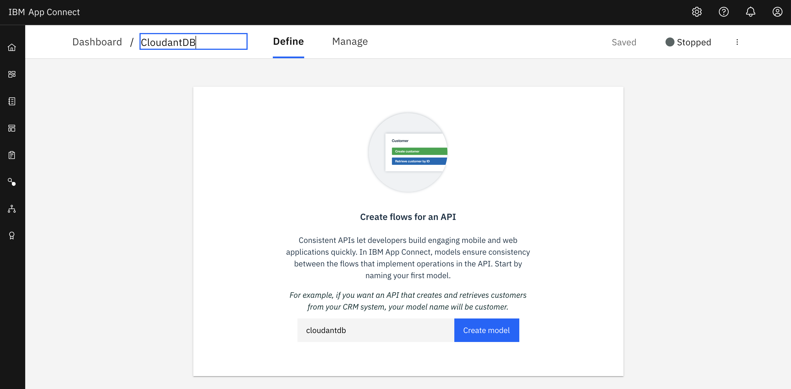

Create a property called `dbname`
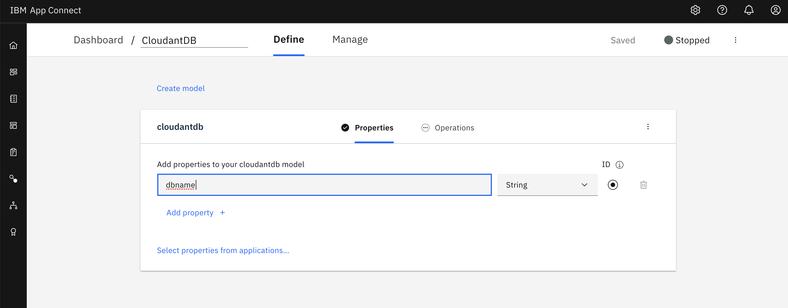

On the `Operation` tab add operations `Create cloudantdb` and `Retrieve cloudantdb with filter` 
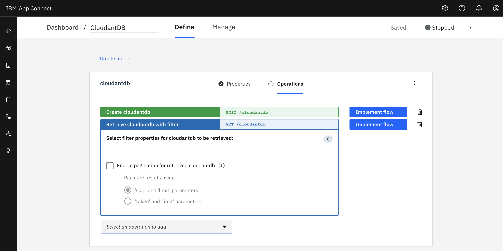

### Step 3 
Lets implement `Create  cloudantdb` flow.  Request node should look like : 
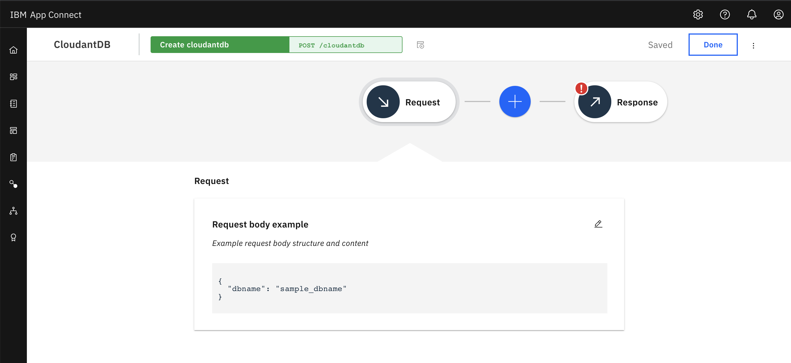

Add the Cloudant application and select the `Create Database` method. For the Database name select `dbname` from the property dropdown.
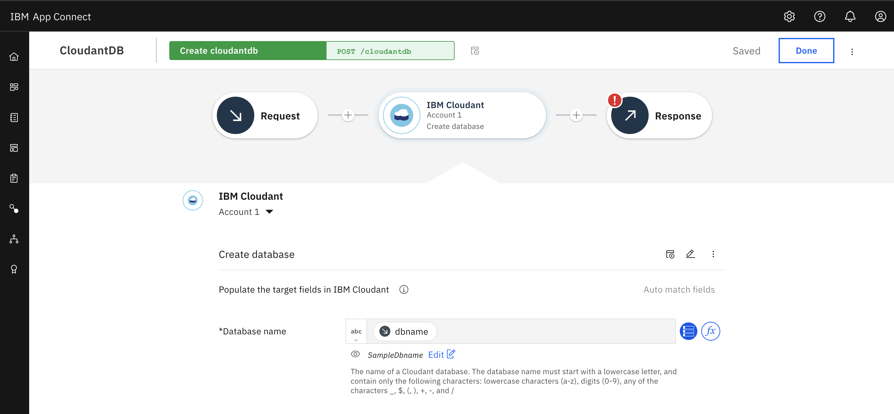

For the Response node add Database name from cloudant in the response body 
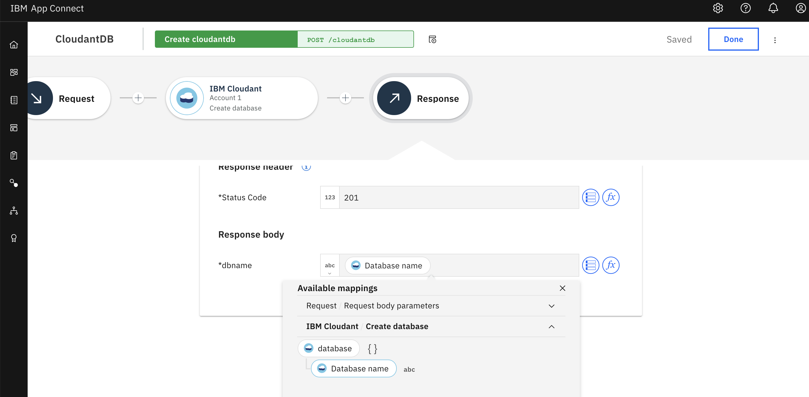

### Step 4 
Click on the flow name to go back to the operations page. We will now be implementing and editing the `Retrieve cloudantdb with filter` flow. 
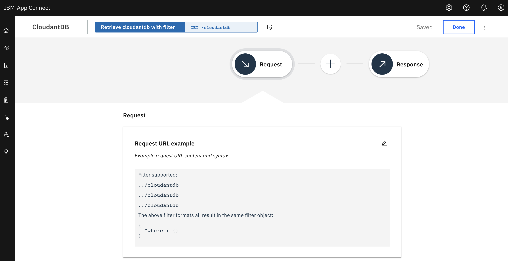

We will be adding the Cloudant Application to the flow using the `Retrieve databases` method : 
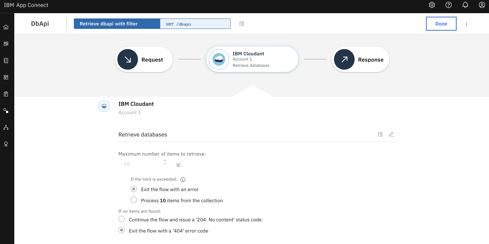

We will be retrieving a list of data bases created. Edit the Response flow as followed : 
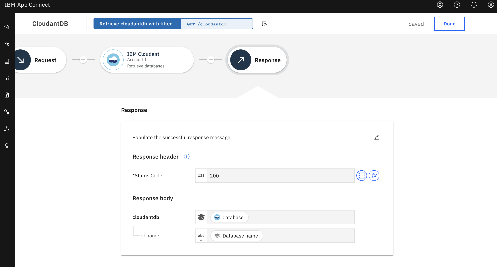

Press the `Done` button on top right corner. 

### Step 5
Now that the flow creation is done, we have to create an API to call the flow. To do this go to manage section of the dashboard. 
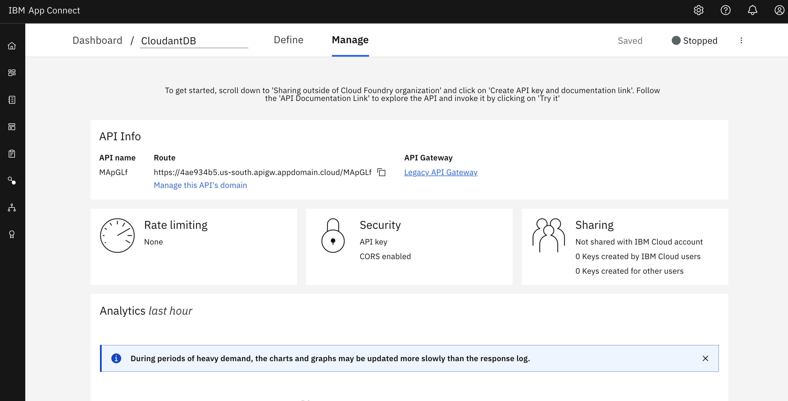

Scroll to the bottom of the page to the `Sharing Outside Cloud Foundry organization`. Click on the Create API key and documentation link. Add a name and click on create. 
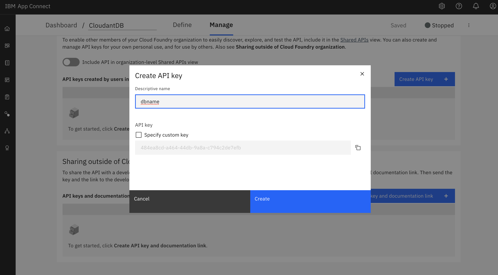

Refresh the page. Start the flow by clicking Start from right corner of the screen.`Manage -> Start API` and then click on the API link from `Manage -> Sharing Outside Cloud Foundry organization -> Click API link`. This will redirect you to the API page.
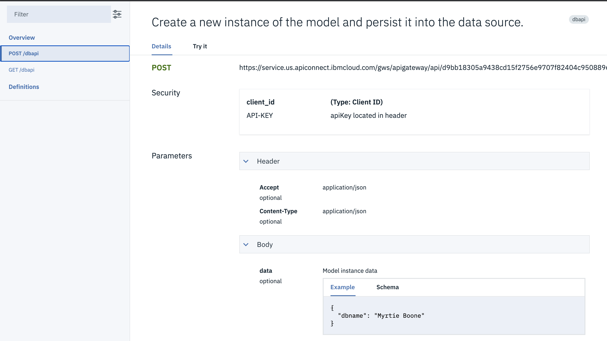

Click on each API and go to the `Try it` tab. Add your API key in the `Client ID` for each API. 

For the POST API your output should look like : 
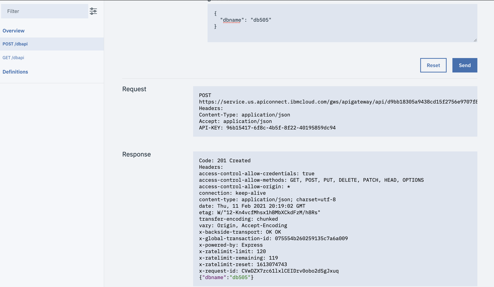

For the GET API your output should look like : 
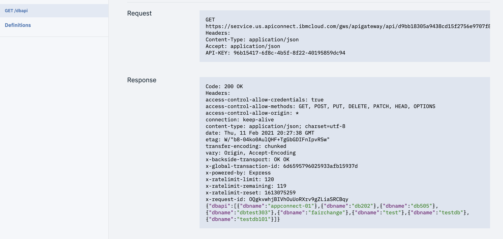

Congratulations! You created a POST api and GET api to create and retrieve databases on cloudant. 

[Lab 1 : Creating Event Driven Flow](https://github.com/pmmistry/AppConnectWorkshop/blob/main/EventFlow.md) 
[Lab 2 : Creating API Flow](https://github.com/pmmistry/AppConnectWorkshop/blob/main/APIFlow.md)
[Lab 3 : Working with Templates and Slack](https://github.com/pmmistry/AppConnectWorkshop/blob/main/Templates.md)

