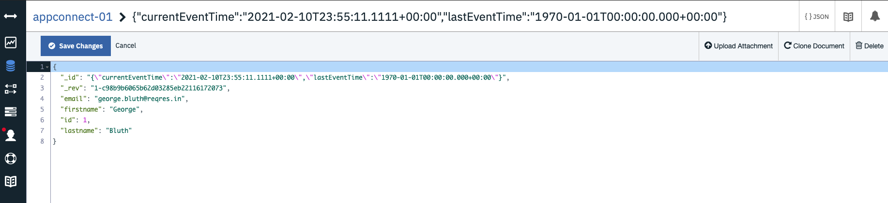

# Building a Event Driven Flow with HTTP Response and Cloudant 

As described in the main [ReadME](https://github.com/pmmistry/AppConnectWorkshop#event-driven-flows), Event driven flows enable you to identify an event that can occur in your first application (the source application), and actions that can be performed in one or more target applications. 

In today's workshop we will configure a simple Event driven flow that uses a Scheduler node to kick off a response from an Http response node (the source application) to send data into a Cloudant database (the target application)

## Prerequisites
- [Create IBM Cloud Account](https://github.com/pmmistry/AppConnectWorkshop#prerequisites)
- [Create App Connect Service](https://github.com/pmmistry/AppConnectWorkshop#prerequisites)
- [Create Cloudant Database](https://github.com/pmmistry/AppConnectWorkshop#prerequisites)
- [Create Event Stream Service(Optional)](https://github.com/pmmistry/AppConnectWorkshop#setting-up-event-stream-optional)

## Workshop

### Step 1 
Start off by launching your App Connect Service. Omce you have launched your service click on `Create an event-driven flow`


### Step 2
To add applications to your flow, Click on '+' and select applications that you want to add to your flow. We are first going to start of with the `Scheduler` tool. To add this to your flow, `+ > Toolbox > Scheduler` 


> Also give your flow a name. I called mine `Http Response Flow` 

### Step 3 
Configure the scheduler component according to your preferences. Here I am creating a flow that sends http response for an API  every one minute. I have also set it to run when the flow is first switched on. 


### Step 4 
To add the next node to the flow, click on '+'. Here, we are adding Http Response node so that we will be able to send an API response at scheduled time. To do this, `+ -> Applications -> HTTP -> Invoke method`. Once you have that set click `Connect`


We will be working with the following API : `https://reqres.in/api/users/1`

Add this API to the `Secure Gateway Protocol` and click `Connect`: 


You will then need to set the Invoke Method details. 
 - Set HTTP method to `GET`
 - Set URL to API url : `https://reqres.in/api/users/1`


You should now have you API method all set up. You can actually test your API by clicking on the `Try this action button` : 


If you click on `View details` you should see the details of your actions : 


### Step 5 
Once you have your HTTP response node working you will need to parse the Response body data. You will need to use a `JSON Parser` node for that. Add a `Json Parser` node from the toolkit and for the JSON Input field select Response Body


You will then need to set the Output Schema for this request. In your output schema example json add the following schema derived from the API : `https://reqres.in/api/users/1` 
> Note : If you put this url in a browser you will see the following schema 

```
{"data":{"id":1,"email":"george.bluth@reqres.in","first_name":"George","last_name":"Bluth","avatar":"https://reqres.in/img/faces/1-image.jpg"},"support":{"url":"https://reqres.in/#support-heading","text":"To keep ReqRes free, contributions towards server costs are appreciated!"}}

```
Click on `Generate Schema` and you should see the schema being generated below : 


### Step 6
Now that you have your JSON parser set up we can set up the Cloudant database. This is where the HTTP request data will be stored. Find `IBM Cloudant` in Applications and select `Create Document`. 


We will need to connect to a Cloudant Database. Go to your [Service Credentials for Cloudant on IBM](https://github.com/pmmistry/AppConnectWorkshop#step-3-1) and add your `username` , `host` and `apikey`. Once you have filled out these fields. Select Connect. 


After you have connected to your Cloudant service, find the database you have created and add it to the Database field. 
> Note : If you have not created a database in cloudant follow [these steps](https://github.com/pmmistry/AppConnectWorkshop#step-4)

For the `Document ID` select `scheduler`. Click on `Add properties` and add the following properties : 


Then you can click on `Edit Mapping` and for each property you can selct the dropdown menu and find associated property from the JSON Parser 


In the end you should have something like this : 


### Step 7 
Now that you have all your nodes set up you can Start the flow from upper right hand corner. 


If you go to your Cloudant database you should see the following data : 


Congratulations! you have created an end-to-end flow in App Connect! 

## Event Streams and Cloudant Flow (Optional)
Now that you have learned how to created a HTTP response flow with APP connect, you can take this one step further and create a flow with Event Streams. 

Built on open source Apache Kafka, [IBM Event Streams](https://www.ibm.com/cloud/event-streams) is an event-streaming platform that helps you build smart applications that can react to events as they happen. 

Follow this video to get a step by step overview on how to go about doing this

[](https://www.youtube.com/watch?v=ZW0Psrzxn2A&t=259s)

