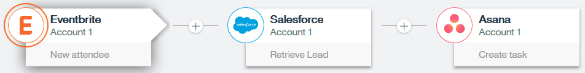
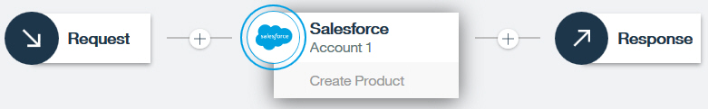
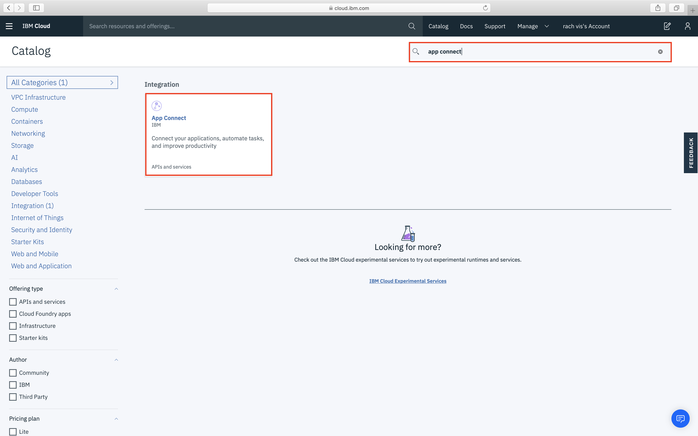
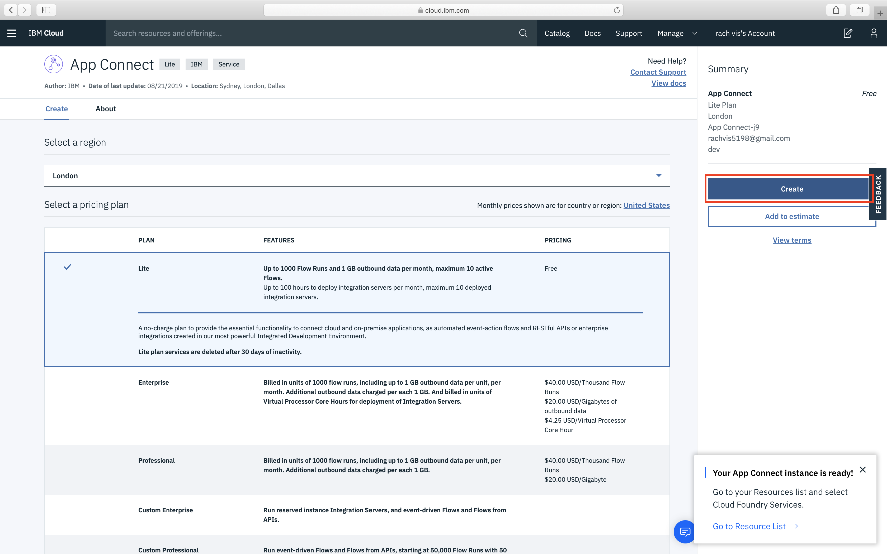
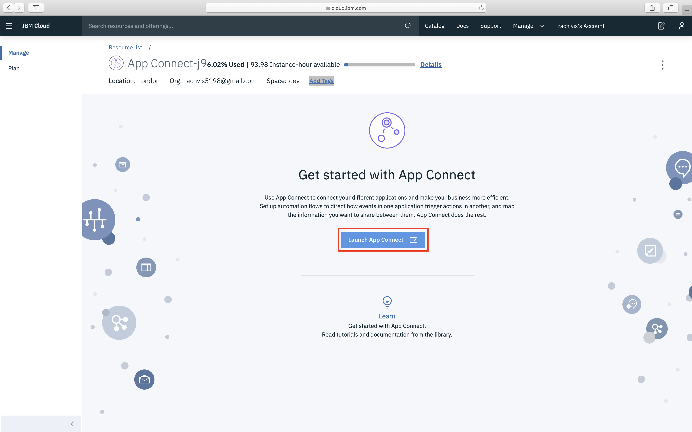
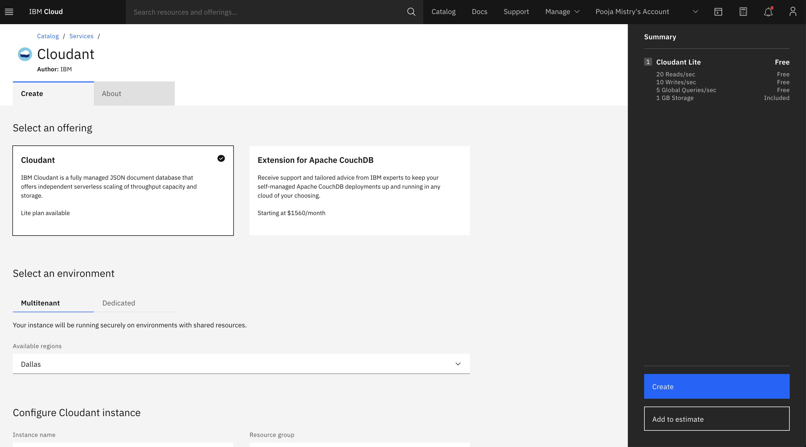
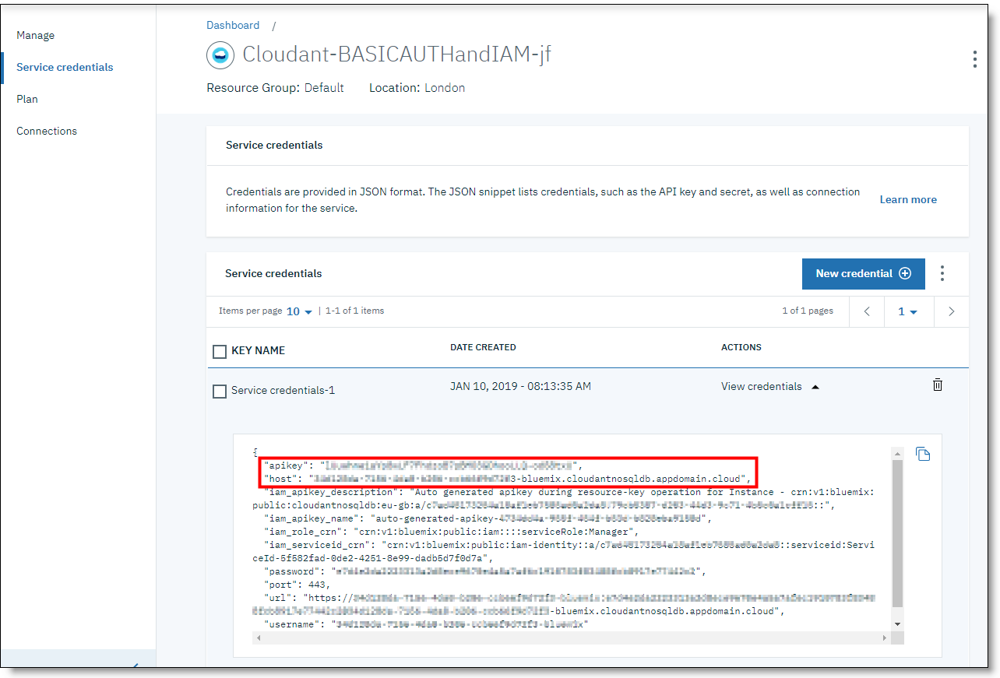
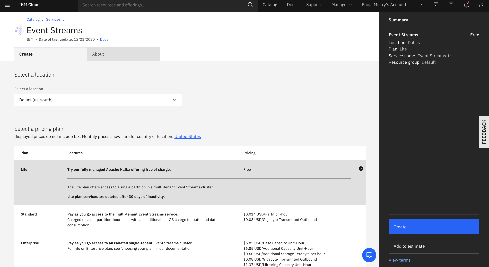

# Building Integrations with App Connect 

[IBM® App Connect](https://www.ibm.com/cloud/app-connect) instantly connects applications and data from existing systems and modern technologies across all environments. You can use App Connect to create **event-driven flows** or **flows for APIs**. 

### Event Driven Flows: 
In an event-driven flow, you identify an event that can occur in your first application (the source application), and actions that can be performed in one or more target applications. The flow links the event to the actions so that, whenever the event occurs in the source application, the action is automatically triggered in the target applications.

For example, you might create a flow so that whenever someone registers as a new attendee with Eventbrite (the event), App Connect automatically retrieves details of the attendee from Salesforce and creates a task in Asana (the actions). 

### Flows for API:
A flow for an API contains a request, one or more target application actions, and a response. The request uses a model that you define to request the creation, replacement, or retrieval of data objects in your applications. When the request is submitted, each target application performs its action. The flow then returns a response that either confirms that the actions were successful, or returns the data that was requested.

[See App Connect Concepts](https://cloud.ibm.com/docs/AppConnect?topic=AppConnect-concepts)

### In workshop we will go through: 
- [Lab 1 : Creating Event Driven Flow](https://github.com/pmmistry/AppConnectWorkshop/blob/main/EventFlow.md) 
- [Lab 2 : Creating API Flow](https://github.com/pmmistry/AppConnectWorkshop/blob/main/APIFlow.md)
- [Lab 3 : Working with Templates and Slack](https://github.com/pmmistry/AppConnectWorkshop/blob/main/Templates.md)

## Getting Started: 
In this workshop we will get you started with creating a Lite App Connect Service on IBM Cloud 

### Prerequisites
Register and create an [IBM Cloud Account](https://ibm.biz/ibm-tcs-workshop) 

### Setting up App Connect Service 

#### Step 1: 
Go to [IBM Cloud Catalog](https://cloud.ibm.com/catalog) and search for App Connect.

#### Step 2: 
Select `Lite` Plan and give your service a name. Click on the `Create` Button to create your Lite service

#### Step 3: 
Launch the service by clicking `Launch App Connect`

### Setting up Cloudant
In this workshop we will mainly be working with passing datat to the Cloudant database. 

#### Step 1: 
Go to [IBM Cloud Catalog](https://cloud.ibm.com/catalog) and search for Cloudant.

#### Step 2: 
Select `Lite` Plan and give your service a name. Click on the `Create` Button to create your Lite service. 

#### Step 3: 
Go to your Cloudant Service and take note of your Service Credentials. To view the service credentials, click `Service credentials` in the left pane, and then click down arrow to view credentials.
> Note : If you don't see service credentials by default you will need to create them. Go to Service Credentials > New Credential > Role - Manager > Add 

#### Step 4: 
Go to `Manage` in the left pane and `Launch Dashboard`. Once you launch your dashboard on the top right hand side you will see `Create Database`. Give your database a name and create a `Non-partitioned` database. We will be using this database in our labs. 

### Setting up Event Stream (Optional)
In an optional workshop we have an example integrating a [Event Stream Service](https://www.ibm.com/cloud/event-streams)

#### Step 1: 
Go to [IBM Cloud Catalog](https://cloud.ibm.com/catalog) and search for Event Streams.

#### Step 2: 
Select `Lite` Plan and give your service a name. Click on the `Create` Button to create your Lite service. 

#### Step 3: 
Go to your Event Stream and take note of your Service Credentials. To view the service credentials, click `Service credentials` in the left pane, and then click down arrow to view credentials. Take a note of these service credentials for optional lab

### Labs 
Now that we have all of our services set up we can move on to the labs. 

> Note : Start with Lab 1 to understand the basics of App Connect 

- [Lab 1 : Creating Event Driven Flow](https://github.com/pmmistry/AppConnectWorkshop/blob/main/EventFlow.md) 
- [Lab 2 : Creating API Flow](https://github.com/pmmistry/AppConnectWorkshop/blob/main/APIFlow.md)
- [Lab 3 : Working with Templates and Slack](https://github.com/pmmistry/AppConnectWorkshop/blob/main/Templates.md) 

 

