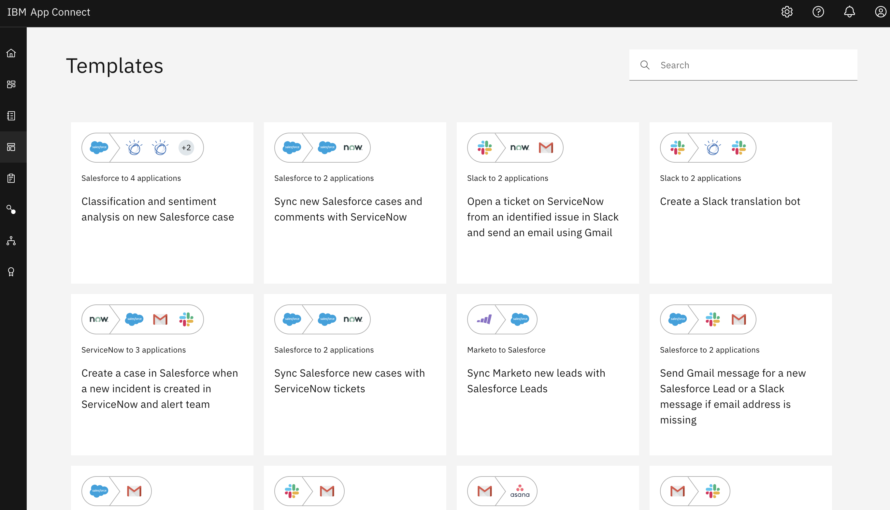
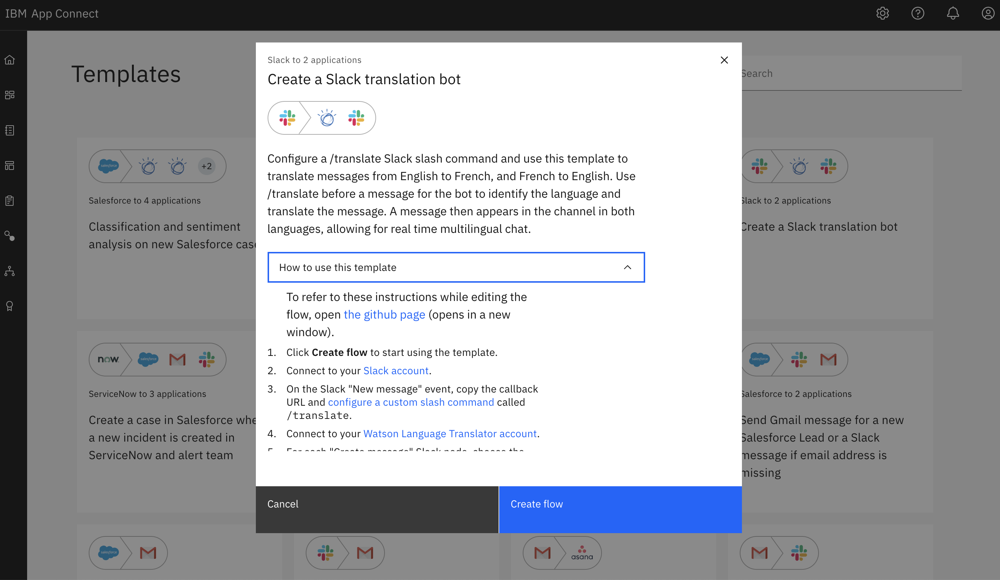
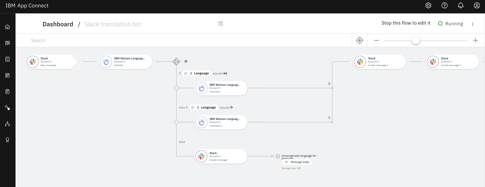
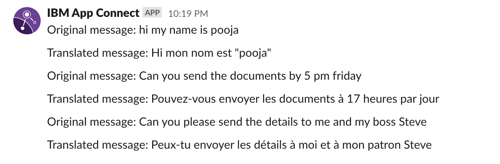
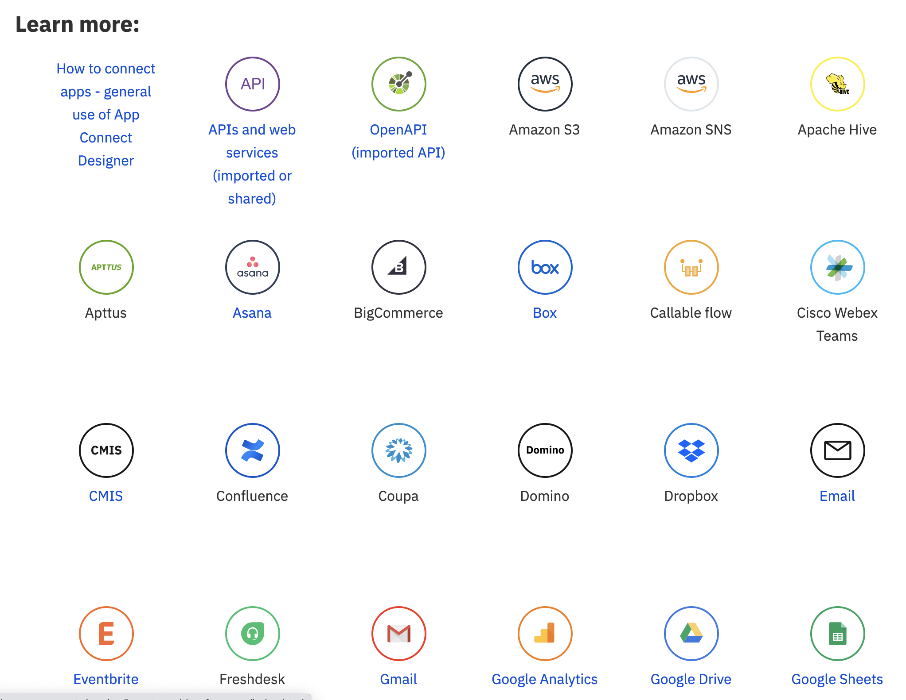

# Working with Templates & Slack 
In the last two labs you learned about building [Event Driven Flows](https://github.com/pmmistry/AppConnectWorkshop/blob/main/EventFlow.md) and [API Flows](https://github.com/pmmistry/AppConnectWorkshop/blob/main/APIFlow.md). In this lab we will use those concepts to work with pre-created templates. 

The Templates gallery of IBM App Connect on IBM Cloud provides a growing set of templates, covering a range of cognitive, marketing, sales, support, business ops, e-commerce, and finance use cases. These templates make use of key connectors such as Salesforce, SAP, Netsuite, Watson, MS Dynamics, Marketo, and others.

To use the templates, open IBM App Connect on IBM Cloud, then select the Templates tab. To browse and perhaps use a template, click the template tile in the gallery. In the overlay displayed, you can read information about how to use the template and can click a button to create the flow from the template. You can then go to your dashboard to validate and finish the flow for your environment, and optionally to adapt the flow for your own needs.

[View Docs to get started](https://www.ibm.com/support/knowledgecenter/en/SS6KM6/com.ibm.appconnect.dev.doc/templates/index.html)

## Create a Slack translation bot
Today we will be creating the slack translation bot from the template 

### Instructions : 

1. Click **Create flow** to start using the template.
1. Connect to your [Slack account](https://developer.ibm.com/integration/docs/app-connect/how-to-guides-for-apps/use-ibm-app-connect-slack/).
1. On the Slack "New message" event, copy the callback URL and [configure a custom slash command](https://developer.ibm.com/integration/docs/app-connect/how-to-guides-for-apps/use-ibm-app-connect-slack/#considerations) called `/translate`.
1. Connect to your [Watson Language Translator account](https://developer.ibm.com/integration/docs/app-connect/how-to-guides-for-apps/use-ibm-app-connect-watson-language-translator/).
1. For each "Create message" Slack node, choose the channel that you want to post the message to.
1. To start the flow, in the banner open the options menu [&#8942;] then click **Start flow**.

You should see : 

Congratulations on getting the Slack Translation template working. Check out the [How-to guides for Apps](https://www.ibm.com/support/knowledgecenter/SS6KM6/com.ibm.appconnect.dev.doc/how-to-guides-for-apps/index.html) learn how to work with other associated apps :  

#### Check out some other labs to learn more
- [Lab 1 : Creating Event Driven Flow](https://github.com/pmmistry/AppConnectWorkshop/blob/main/EventFlow.md) 
- [Lab 2 : Creating API Flow](https://github.com/pmmistry/AppConnectWorkshop/blob/main/APIFlow.md)
- [Lab 3 : Working with Templates and Slack](https://github.com/pmmistry/AppConnectWorkshop/blob/main/Templates.md)

